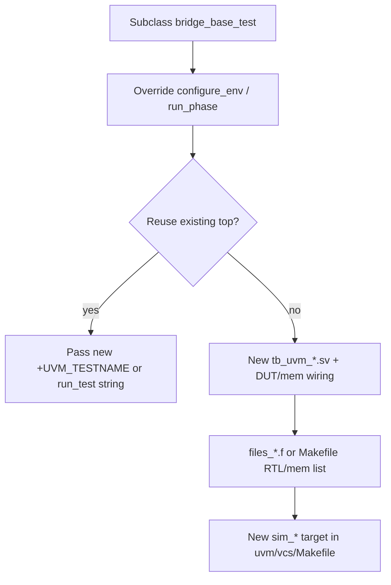
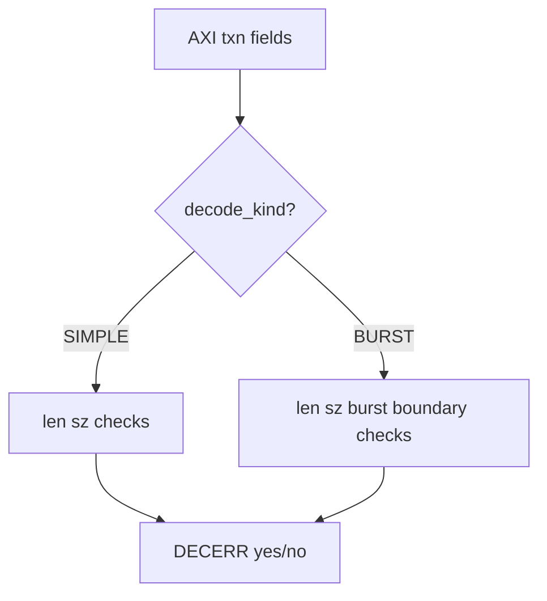

# UVM Development & Extension Guide

This document provides technical details for developers looking to extend or debug the UVM environment.

Related navigation: [`README.md`](README.md) (architecture), [`sv/README.md`](sv/README.md) (per-folder maps).

## `uvm_config_db` usage (this environment)

| Key type | Typical path | Set by | Consumed by |
|----------|--------------|--------|-------------|
| `bridge_env_cfg` | `"env"`, field `"cfg"` | `bridge_base_test::build_phase` | `bridge_env::build_phase` |
| `virtual axi4_master_if #(...)` | `"env.axi_mon"`, `"vif"` | `bridge_base_test` | `bridge_axi_monitor` |
| `v_axi_if_64_t` / `v_axi_if_32_t` | `""`, `"axi_vif"` | Testbench top | `bridge_base_test` |
| Other VIP/IF handles | per TB | Top or test | Monitors / stimulus |

Paths use UVM component hierarchy strings: the test creates `env`, so the AXI monitor is `"env.axi_mon"`.

## Adding a new test

Checklist:

1.  **Define a new test class** in `uvm/sv/pkg/bridge_uvm_tests_pkg.sv` (or a new file included in that package).
    - Inherit from **`bridge_base_test #(DW)`** (where `DW` is 32 or 64).
    - Override **`configure_env()`** to tune `env_cfg` (e.g., set `apb_sel_bit`, `decode_kind`).
    - Implement the stimulus in `run_phase`.
2.  **Create a new top-level TB** in `uvm/tb/` if needed (e.g., `tb_uvm_new_feature.sv`).
    - Instantiate the DUT and interfaces.
    - Call `run_test()`.
3.  **Add a `.f` file** in `uvm/vcs/` (e.g., `files_new_feature.f`) listing all required files (and mirror **Makefile `+incdir+`** from [`vcs/README.md`](vcs/README.md)).
4.  **Update the Makefile** in `uvm/vcs/Makefile` to include a new simulation target.

## Extending the Stimulus

Stimulus is currently managed in `bridge_stimulus_pkg.sv` using helper classes like `bridge_axi_stim_64`. While not a pure UVM sequence-based approach, it allows for easy mirroring of the RTL testbenches.

To transition to UVM sequences:
1.  Add a `bridge_axi_sequencer` and `bridge_axi_driver` to the `axi_monitor` (converting it into a full UVC).
2.  Define `uvm_sequence` items for AXI transactions.

## Scoreboard Deep Dive

The `bridge_scoreboard` is the heart of the verification. It uses TLM imp ports to receive transactions from the AXI and APB monitors.

### DECERR prediction

The bridge variants handle illegal transactions differently. The scoreboard uses `bridge_aw_txn_decerr` and `bridge_ar_txn_decerr` to match the RTL's internal error decoding logic.

| Variant (`decode_kind`) | Treated as DECERR (summary) |
|-------------------------|-----------------------------|
| **SIMPLE** | Any burst (`len > 0`), or `axsize` not matching data width. |
| **BURST** | Wrong `axsize`, unsupported burst type (e.g. WRAP), or **INCR** burst that crosses the `apb_sel_bit` boundary. |

### Shadow RAM

| Aspect | Detail |
|--------|--------|
| Storage | `logic [63:0] slv_shadow[int unsigned]` (associative array) |
| Key | `ram_key_of(port_ix, paddr)` |
| Write commit | On successful APB write completion observed by monitor |
| Read check | APB beat and full AXI `RDATA` vs shadow content |

## Debugging mismatches

| Symptom | First checks |
|---------|----------------|
| Address / port mismatch | `apb_sel_bit` agreement between TB `env_cfg`, DUT tie-offs, and stimulus addresses. |
| Data mismatch | Ordering: outstanding `pred_wr` / `buf_wr_obs` in `report_phase`; `UVM_HIGH` for predicted vs observed beats. |
| Spurious DECERR | `decode_kind` vs DUT variant (simple vs burst RTL). |

When the scoreboard reports a mismatch:
1.  **Check the logs for `UVM_ERROR`** messages from the scoreboard. They usually indicate whether it was an address, data, or metadata (port/pwrite) mismatch.
2.  **Enable `UVM_HIGH` verbosity** to see every predicted and observed beat.
3.  **Check the observation queues** reported in the `report_phase`. Outstanding items in `pred_wr` or `buf_wr_obs` indicate missing completions or ordering issues.
4.  **Trace the `apb_sel_bit`:** Ensure the TB and DUT agree on which address bit selects the APB port.

## Linting & Quality

Always run `make lint-uvm-sv` before committing. The UVM environment is linted with Verilator in strict mode to ensure high-quality SystemVerilog code.
