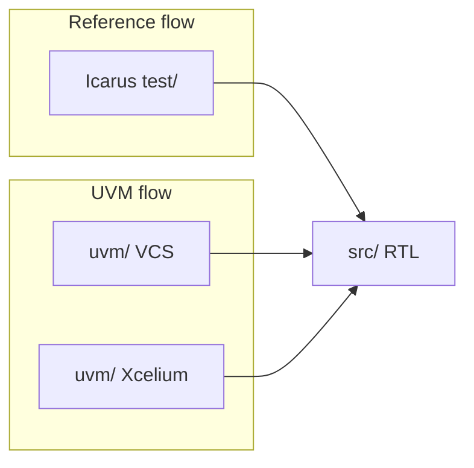
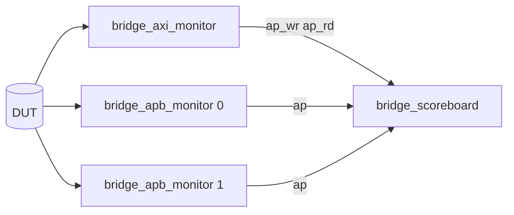

# UVM Verification Environment

This directory contains a UVM-based verification environment for the AXI4-to-APB4 bridge. It mirrors the Icarus Verilog RTL testbenches found in `test/` but provides a more robust, object-oriented verification framework using SystemVerilog and UVM.

## Ramp-up (suggested reading order)

| Step | Document / code | What you get |
|------|-----------------|--------------|
| 1 | [`../doc/design_contract.md`](../doc/design_contract.md) | Expected bridge behavior and integration assumptions. |
| 2 | This README (overview + tables below) | Mapping from Icarus TBs to UVM tops and components. |
| 3 | [`sv/README.md`](sv/README.md) + subdirectory READMEs | Navigate `pkg/`, `env/`, `monitors/`, `scoreboard/`, etc. |
| 4 | [`sv/env/bridge_env.sv`](sv/env/bridge_env.sv) | How analysis ports connect to the scoreboard. |
| 5 | [`sv/scoreboard/bridge_scoreboard.sv`](sv/scoreboard/bridge_scoreboard.sv) | Prediction and checking (with [`GEMINI.md`](GEMINI.md) for DECERR/shadow-RAM detail). |
| 6 | [`GEMINI.md`](GEMINI.md) | Extend tests, debug mismatches, quality gates. |

## RTL vs UVM at a glance



Both flows hit the same DUT sources under `src/`; UVM adds monitors, TLM, and a predictive scoreboard. Stimulus helpers intentionally mirror the Icarus benches—see `scripts/uvm_mirror_check.py` (`make check-uvm-mirror` from the repo root).

## Architecture

The environment is designed to be highly configurable, supporting both 32-bit and 64-bit data widths, and different bridge variants (Simple vs. Burst).

```text
                               +------------------------------------------+
                               |         bridge_uvm_tests_pkg             |
                               | (test_bridge_simple, test_bridge_burst)  |
                               +--------------------+---------------------+
                                                    |
                                                    v
                               +------------------------------------------+
                               |         bridge_uvm_env_pkg               |
                               |                                          |
                               |    +--------------------------------+    |
                               |    |           bridge_env           |    |
                               |    |                                |    |
                               |    |  +-------------+   +---------+ |    |
                               |    |  | axi_monitor |-->|         | |    |
                               |    |  +-------------+   |         | |    |
                               |    |                    | bridge  | |    |
                               |    |  +-------------+   |   sb    | |    |
                               |    |  | apb_monitor0|-->|         | |    |
                               |    |  +-------------+   |         | |    |
                               |    |                    |         | |    |
                               |    |  +-------------+   |         | |    |
                               |    |  | apb_monitor1|-->|         | |    |
                               |    |  +-------------+   +---------+ |    |
                               |    +--------------------------------+    |
                               +--------------------+---------------------+
                                                    |
                                                    v
         +--------------------------------------------------------------------------+
         |                                 DUT (RTL)                                |
         |                       (axi4_to_apb4_2x_simple/burst)                     |
         +--------------------------------------------------------------------------+
```

### TLM data path (monitor → scoreboard)



## Layout

| Icarus test | UVM top | Test class | Description |
|-------------|---------|------------|-------------|
| `tb_axi4_to_apb4_2x_simple` | `tb_uvm_simple` | `test_bridge_simple` | Single beat AXI to APB. |
| `tb_axi4_to_apb4_2x_burst` | `tb_uvm_burst` | `test_bridge_burst` | Multi-beat INCR/FIXED bursts. |
| `tb_axi4_to_apb4_2x_burst_ext` | `tb_uvm_burst_ext` | `test_bridge_burst_ext` | Extended bursts with error injection. |
| `tb_axi4_to_apb4_2x_simple_ws` | `tb_uvm_simple_ws` | `test_bridge_simple_ws` | Simple test with APB wait-states. |
| `tb_parameterized_config` | `tb_uvm_parameterized` | `test_bridge_parameterized_cfg` | 32-bit bridge with custom select bit. |

## Directory structure

| Path | README / role |
|------|----------------|
| [`sv/`](sv/README.md) | All SystemVerilog UVM collateral; start here for per-folder tables. |
| [`sv/pkg/`](sv/pkg/README.md) | `bridge_stimulus_pkg`, `bridge_uvm_env_pkg`, `bridge_uvm_tests_pkg`. |
| [`sv/env/`](sv/env/README.md) | `bridge_env`, `bridge_env_cfg`. |
| [`sv/monitors/`](sv/monitors/README.md) | AXI and APB passive monitors. |
| [`sv/scoreboard/`](sv/scoreboard/README.md) | Predict + check. |
| [`sv/transactions/`](sv/transactions/README.md) | Sequence items and decode enum. |
| [`sv/interfaces/`](sv/interfaces/README.md) | `axi4_master_if`, `apb_mon_if`, … |
| [`sv/models/`](sv/models/README.md) | APB behavioral memories. |
| [`tb/`](tb/README.md) | Top modules and `run_test(...)` wiring. |
| [`vcs/`](vcs/README.md) | Makefile and file lists for Synopsys VCS. |
| [`xcelium/`](xcelium/README.md) | Makefile and file lists for Cadence Xcelium. |
| [`lint/`](lint/README.md) | Verilator lint shims. |

### Package hierarchy

```text
bridge_stimulus_pkg.sv
    +-- (stimulus helpers)

bridge_uvm_env_pkg.sv
    +-- import bridge_stimulus_pkg
    +-- bridge_env_cfg.sv          (from ../env/)
    +-- bridge_transactions.sv     (from ../transactions/)
    +-- [prediction functions in-package]
    +-- bridge_axi_monitor.sv      (+incdir+ ../monitors/)
    +-- bridge_apb_monitor.sv
    +-- bridge_scoreboard.sv
    +-- bridge_env.sv              (from ../env/, via +incdir+)

bridge_uvm_tests_pkg.sv
    +-- import bridge_stimulus_pkg
    +-- import bridge_uvm_env_pkg
    +-- test classes (bridge_base_test, test_bridge_*)
```

## Verification Components

### Configuration (`bridge_env_cfg`)

The environment is controlled via the `bridge_env_cfg` object, which should be set in the UVM configuration database.

| Field | Type | Default | Description |
|-------|------|---------|-------------|
| `data_width` | `int unsigned` | 64 | AXI and APB data width (32 or 64). |
| `addr_width` | `int unsigned` | 32 | AXI and APB address width. |
| `apb_sel_bit` | `int unsigned` | 31 | Address bit used for APB port selection (RTL `APB_ADDR_BIT`). |
| `decode_kind` | `bridge_decode_kind_e` | `BRIDGE_DECODE_BURST` | Selects between `SIMPLE` and `BURST` bridge variants for DECERR prediction. |
| `apb_mem_addr_msb` | `int unsigned` | 9 | MSB for shadow RAM word indexing. |
| `apb_mem_addr_lsb` | `int unsigned` | 2 | LSB for shadow RAM word indexing. |
| `has_scoreboard` | `bit` | 1 | Enable/disable the scoreboard. |
| `enable_axi_mon` | `bit` | 1 | Enable/disable the AXI monitor. |
| `enable_apb_mons` | `bit` | 1 | Enable/disable the APB monitors. |

### Transactions

| Class | Base | Key Fields |
|-------|------|------------|
| `bridge_axi_wr_tr` | `uvm_sequence_item` | `addr`, `awlen`, `awsize`, `awburst`, `id`, `bresp`, `wdata[]`, `wstrb[]` |
| `bridge_axi_rd_tr` | `uvm_sequence_item` | `addr`, `arlen`, `arsize`, `arburst`, `id`, `rresp`, `rdata[]` |
| `bridge_apb_tr` | `uvm_sequence_item` | `port`, `paddr`, `pwrite`, `pwdata`, `pstrb`, `prdata`, `pslverr` |

### Scoreboard (`bridge_scoreboard`)

The scoreboard performs the following checks:
- **Transaction Prediction:** It expands AXI transactions into expected APB beats based on `awsize`/`arsize` and `awlen`/`arlen`.
- **Address Routing:** Validates that transactions are routed to the correct APB port based on `apb_sel_bit`.
- **Error Prediction:** Predicts `DECERR` for illegal transactions (e.g., crossing the `apb_sel_bit` boundary in `BURST` mode, or any burst in `SIMPLE` mode).
- **Data Integrity:** Maintains a **dual-port shadow RAM** to check read data (`PRDATA` and AXI `RDATA`) against previous writes.
- **Ordering:** Uses observation queues to reconcile AXI completions and APB events, ensuring correct temporal behavior.

### Memory Models (`sv/models/`)

The environment uses various APB memory models to simulate the slave devices:
- `apb_dual_mem_simple.sv`: Basic dual-port APB memory (32-bit/64-bit).
- `apb_dual_mem_burst.sv`: Optimized for burst transactions.
- `apb_dual_mem_ws.sv`: Supports configurable read wait-states (controlled by `READ_WS`).
- `apb_dual_mem_param.sv`: Parameterized for different address/data widths.
- `apb_ext_mem_dual.sv`: Used in extended burst tests for larger address ranges.

## Interfaces

| Interface | File | Description |
|-----------|------|-------------|
| `axi4_master_if` | `sv/interfaces/axi4_master_if.sv` | Full AXI4 slave-side interface (DUT is slave). |
| `apb_mon_if` | `sv/interfaces/apb_mon_if.sv` | Passive APB monitor interface. |
| `apb_burst_ext_side_if` | `sv/interfaces/apb_burst_ext_side_if.sv` | Sideband interface for burst/repro tests. |
| `apb_sel_tracker_if` | `sv/interfaces/apb_sel_tracker_if.sv` | Simple tracker for PSEL assertions in parameterized tests. |

## Build & Run

Set `UVM_HOME` so `$UVM_HOME/src/uvm.sv` exists, then `cd` into the simulator subdirectory.

### Synopsys VCS (`uvm/vcs/`)

```bash
export UVM_HOME=/path/to/uvm
cd uvm/vcs
make sim_simple
```

See [`vcs/README.md`](vcs/README.md) for full flag and artifact details.

### Cadence Xcelium (`uvm/xcelium/`)

```bash
export UVM_HOME=/path/to/uvm
cd uvm/xcelium
make sim_simple
```

`xrun` compiles and simulates in one step; output goes to `sim_simple.log`. See [`xcelium/README.md`](xcelium/README.md) for full flag and artifact details.

### Makefile targets (both simulators)

| Target | Test class | Notes |
|--------|-----------|-------|
| `sim_simple` | `test_bridge_simple` | |
| `sim_burst` | `test_bridge_burst` | |
| `sim_burst_ext` | `test_bridge_burst_ext` | |
| `sim_simple_ws` | `test_bridge_simple_ws` | accepts `READ_WS=N` (default 2) |
| `sim_parameterized` | `test_bridge_parameterized_cfg` | |

### Mirror Validation
To ensure the UVM environment stays in sync with the RTL reference testbenches:
```bash
make check-uvm-mirror
```
This runs `scripts/uvm_mirror_check.py` to compare stimulus patterns.

### Linting
```bash
make lint-uvm-sv         # Strict Verilator linting
make lint-uvm-sv-relaxed # Relaxed linting for faster pass
```
