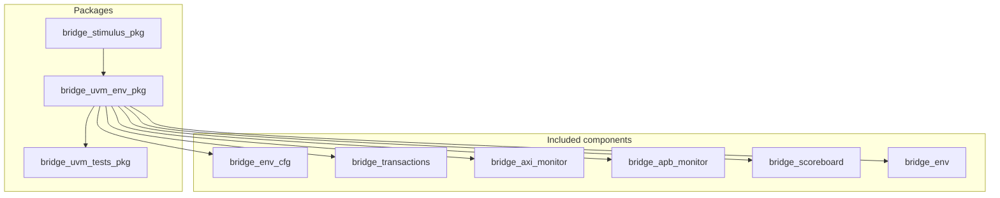

# UVM SystemVerilog sources (`uvm/sv/`)

Passive monitors observe the DUT; the scoreboard predicts APB beats from AXI and checks against observed APB and completed AXI transactions.

## Subdirectories

| Directory | Role | Start here |
|-----------|------|------------|
| [`pkg/`](pkg/README.md) | Packages: env, tests, stimulus helpers | `bridge_uvm_env_pkg.sv` |
| [`env/`](env/README.md) | `bridge_env` wiring, `bridge_env_cfg` | `bridge_env.sv` |
| [`monitors/`](monitors/README.md) | AXI/APB monitors → analysis ports | `bridge_axi_monitor.sv` |
| [`scoreboard/`](scoreboard/README.md) | Prediction + shadow RAM | `bridge_scoreboard.sv` |
| [`transactions/`](transactions/README.md) | `uvm_sequence_item` types | `bridge_transactions.sv` |
| [`interfaces/`](interfaces/README.md) | Virtual interfaces for agents/monitors | `axi4_master_if.sv` |
| [`models/`](models/README.md) | APB slave behavioral memories | `apb_dual_mem_simple.sv` |

## How pieces compile

Both VCS and Xcelium builds add `+incdir+` paths for `pkg`, `env`, `monitors`, `scoreboard`, `transactions`, and `interfaces` so `` `include "bridge_axi_monitor.sv" `` in the env package resolves without relative paths.

- VCS: [`../vcs/Makefile`](../vcs/README.md) — `vcs` compile then `./simv` run
- Xcelium: [`../xcelium/Makefile`](../xcelium/README.md) — `xrun` unified compile+run with `-uvmhome`

## Layer diagram

Parent overview: [`../../README.md`](../../README.md).
