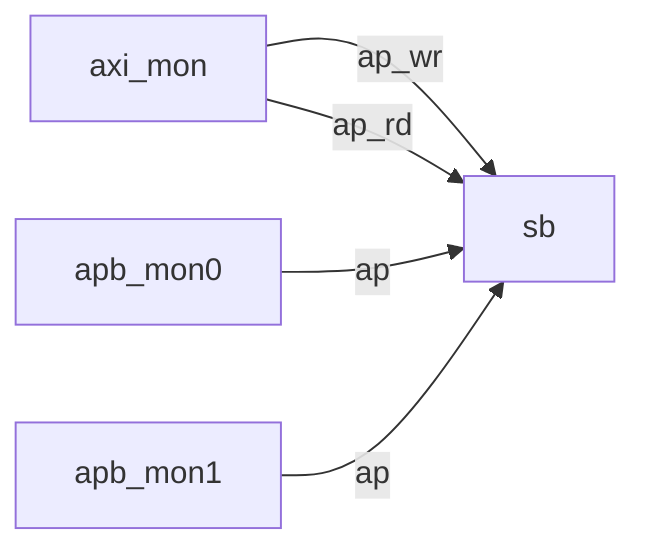

# Environment (`uvm/sv/env/`)

| File | Description |
|------|-------------|
| `bridge_env_cfg.sv` | Configuration object: data width, decode mode, APB select bit, shadow-RAM bounds, monitor/scoreboard enables. Set via `uvm_config_db` from `bridge_base_test`. |
| `bridge_env.sv` | `uvm_env` containing one `bridge_axi_monitor #(DW)`, two `bridge_apb_monitor #(DW,32)` instances (`port_ix` 0 and 1), and optional `bridge_scoreboard`. |

## Connectivity (analysis ports)

`connect_phase` in `bridge_env.sv` wires these only when `cfg.has_scoreboard` is true (scoreboard non-null).

Parent: [`../README.md`](../README.md).
