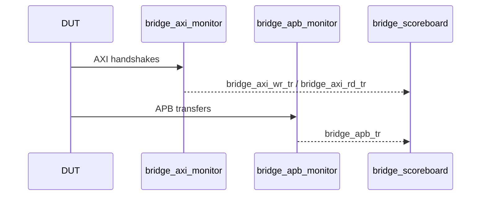

# Monitors (`uvm/sv/monitors/`)

Passive monitors sample DUT interfaces and emit UVM transactions on **analysis ports** (TLM).

| File | Watches | Output |
|------|---------|--------|
| `bridge_axi_monitor.sv` | `axi4_master_if #(…)` (virtual interface in `uvm_config_db`) | Completed write and read transactions: `ap_wr`, `ap_rd`. |
| `bridge_apb_monitor.sv` | `apb_mon_if` per APB port | Per-beat APB activity on `ap`; `port_ix` distinguishes master 0 vs 1. |

## Observation model

`bridge_env_cfg` fields `enable_axi_mon` and `enable_apb_mons` gate construction or activity where implemented.

Parent: [`../README.md`](../README.md).
