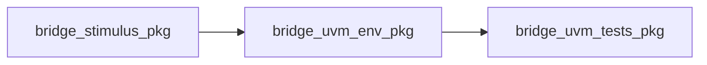

# Packages (`uvm/sv/pkg/`)

SystemVerilog packages group types, prediction helpers, and `` `include ``-based components for the UVM environment.

## Files

| File | Imports / includes | Purpose |
|------|-------------------|---------|
| `bridge_stimulus_pkg.sv` | (none from this repo) | AXI stimulus helpers that mirror Icarus TBs (`bridge_axi_stim_64`, etc.). |
| `bridge_uvm_env_pkg.sv` | `bridge_stimulus_pkg` | Prediction helpers; `` `include `` of [`../env/bridge_env_cfg.sv`](../env/bridge_env_cfg.sv), [`../transactions/bridge_transactions.sv`](../transactions/bridge_transactions.sv), then monitors, scoreboard, and [`../env/bridge_env.sv`](../env/bridge_env.sv) (base names resolved via VCS `+incdir+`). |
| `bridge_uvm_tests_pkg.sv` | `bridge_stimulus_pkg`, `bridge_uvm_env_pkg` | `bridge_base_test`, concrete tests (`test_bridge_simple`, …), `run_test()` entry classes. |

## Dependency order

Compile order in `uvm/vcs/`: stimulus → `bridge_uvm_env_pkg` → `bridge_uvm_tests_pkg` → testbench top.

See [`../README.md`](../README.md) for the full `sv/` map.
