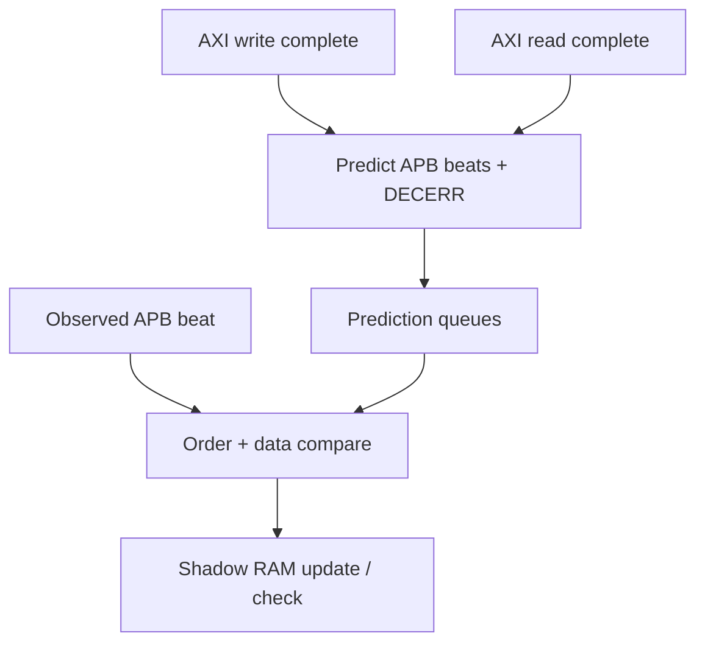

# Scoreboard (`uvm/sv/scoreboard/`)

| File | Role |
|------|------|
| `bridge_scoreboard.sv` | Receives AXI transactions and APB beats via TLM analysis imports; expands AXI to expected APB; checks routing, DECERR prediction, and data against a **shadow RAM**. |

## Logical flow

## Inputs (imp ports)

| Port | Transaction type | Source |
|------|------------------|--------|
| `axi_wr_imp` | `bridge_axi_wr_tr` | `axi_mon.ap_wr` |
| `axi_rd_imp` | `bridge_axi_rd_tr` | `axi_mon.ap_rd` |
| `apb0_imp` | `bridge_apb_tr` | `apb_mon0.ap` |
| `apb1_imp` | `bridge_apb_tr` | `apb_mon1.ap` |

Deep-dive behavior (DECERR rules, shadow RAM keys): [`../../GEMINI.md`](../../GEMINI.md).

Parent: [`../README.md`](../README.md).
