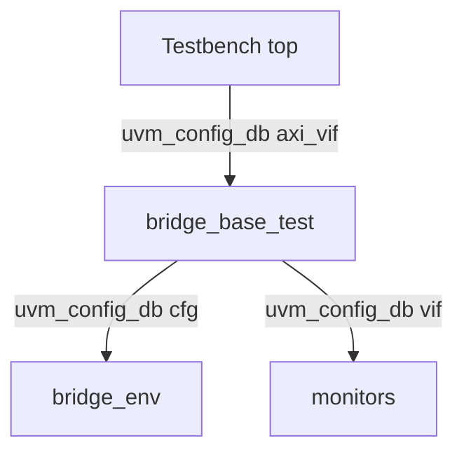

# Testbench tops (`uvm/tb/`)

Each file is a **module** that instantiates the DUT, APB memories, AXI/APB interfaces, and calls UVM (`run_test(...)`).

## Map to simulation

| Top module | `run_test` argument | DUT RTL (typical) | Makefile target |
|------------|--------------------|-------------------|-----------------|
| `tb_uvm_simple` | `test_bridge_simple` | `axi4_to_apb4_2x_simple` | `sim_simple` |
| `tb_uvm_burst` | `test_bridge_burst` | `axi4_to_apb4_2x_burst` | `sim_burst` |
| `tb_uvm_burst_ext` | `test_bridge_burst_ext` | `axi4_to_apb4_2x_burst` | `sim_burst_ext` |
| `tb_uvm_simple_ws` | `test_bridge_simple_ws` | `axi4_to_apb4_2x_simple` | `sim_simple_ws` |
| `tb_uvm_parameterized` | `test_bridge_parameterized_cfg` | (parameterized build) | `sim_parameterized` |

## Config DB pattern

Concrete `configure_env()` overrides set `decode_kind`, `apb_sel_bit`, etc. per test class in `bridge_uvm_tests_pkg.sv`.

Parent: [`../README.md`](../README.md) · VCS: [`../vcs/README.md`](../vcs/README.md) · Xcelium: [`../xcelium/README.md`](../xcelium/README.md).
